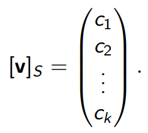
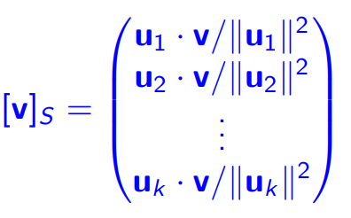
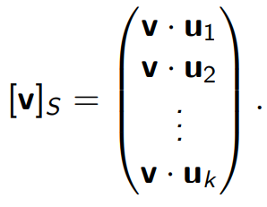
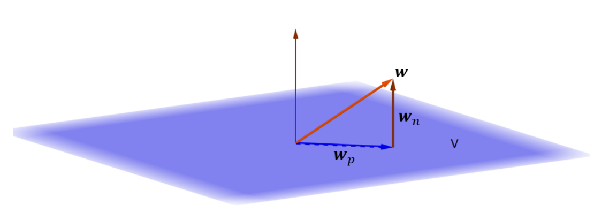
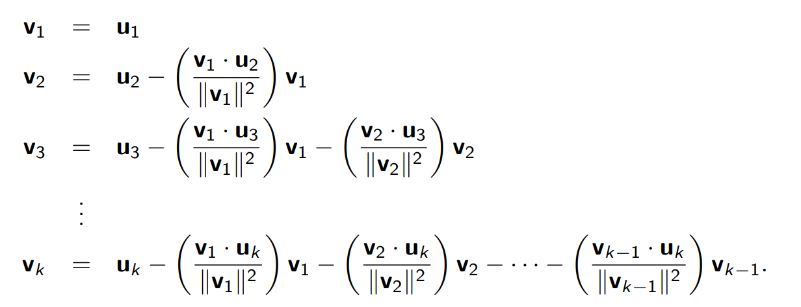
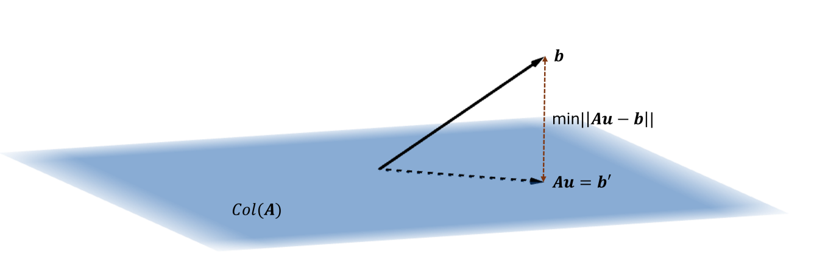
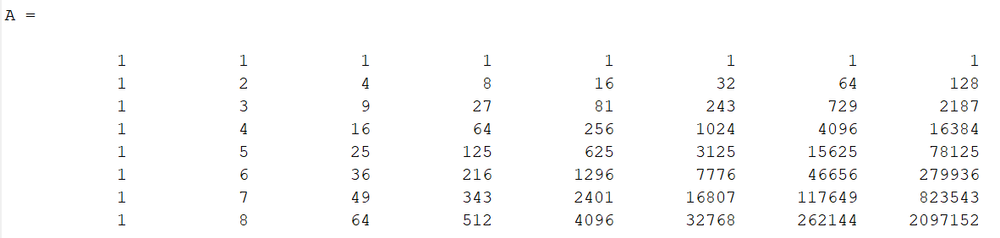
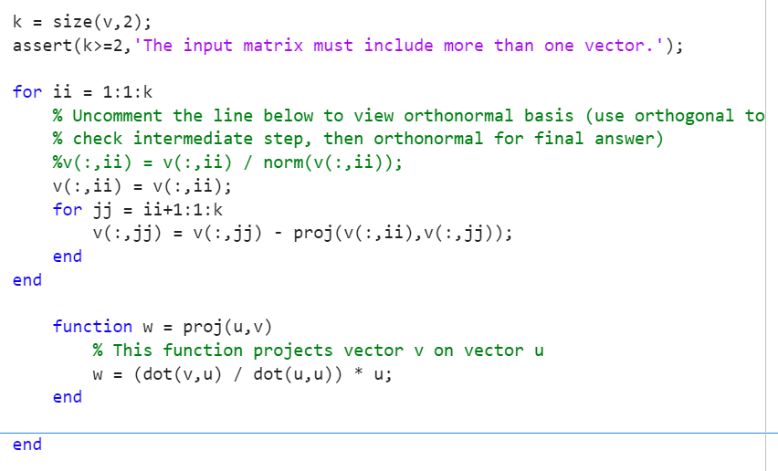

# MA1508E Formulae, Theorems and Definitions

## Updates
* Added the definition for a nilpotent matrix [here](#important-lists-and-properties)
* Added a [new section](#important-matlab-functions) for important MATLAB functions
* Added a [new section](#matlab-algorithms) for the various useful algorithms in MATLAB

## Notes
* I have added in parentheses (...) some additional keywords at some headers for easier lookup for some theorems/definitions/formulae.
* If there are any more definitions or theorems you wish to add, [create an issue](https://github.com/tongkiankiat/MA1508E/issues/new) or let me know directly!
* There are **VERY** important lists/properties I have compiled [here](#important-lists-and-properties), and have also scattered the link throughout the document to send you there directly, but they are also in their own individual sections.
* The order of theorems/definitions might also not follow exactly the order in which they were taught, I mostly grouped them together based on how well they flow.

## Table of Contents

1. **[Chapter 1: Linear Systems](#linear-systems)**
2. **[Chapter 2: Matrix Algebra](#matrix-algebra)**
3. **[Chapter 3: Euclidean Vector Spaces](#euclidean-vector-spaces)**
4. **[Chapter 4: Subspaces Associated to a Matrix](#subspaces)**
5. **[Chapter 5: Orthogonality, Projection, and Least Square Solution](#orthogonality-projection-and-lss)**
6. **[Chapter 6: Eigenanalysis](#eigenanalysis)**
7. **[Chapter 7: System of Linear Differential Equations](#system-of-linear-differential-equations)**
8. **[Important Lists and Properties](#important-lists-and-properties)**
9. **[Important MATLAB Functions](#important-matlab-functions)**
10. **[MATLAB Algorithms](#matlab-algorithms)**

## Linear Systems

### Consistent and Inconsistent Linear Systems

An inconsistent linear system has **no solutions**, whereas a consistent linear system has **at least one solution**.

### Row Echelon Form

1. If there are zero rows, they are at the bottom of the matrix.
2. Leading entries are further to the right as we move down the matrix.

### Reduced Row Echelon Form

Adding on to 1. and 2.,

3. The leading entries are all 1.
4. In each pivot column, all entries except the leading entry is 0.

### Row Equivalent Matrices

* Two (augmented) matrices are **row equivalent** if one can be obtained from the other by performing a set of **elementary row operations**.
* Two linear systems have the **same solutions** if their augmented matrices are **row equivalent**.
    * Their rref forms are the same &#8594; same solution

## Matrix Algebra

### Properties of Matrix Addition and Scalar Multiplication

* **A** + **B** = **B** + **A** (Commutative)
* **A** + (**B** + **C**) = (**A** + **B**) + **C** (Associative)
* **0** + **A** = **A** (Additive Identity)
* **A** + (-**A**) = **0** (Additive Inverse)
* _a_(**A** + **B**) = _a_**A** + _a_**B** (Distributive Law)
* (_a_ + _b_)**A** = _a_**A** + _b_**A** (Scalar Addition)
* (_ab_)**A** = _a_(_b_**A**) (Associative)
* If _a_**A** = **0**, then either _a_ = 0 or **A** = **0**

### Properties of Matrix Multiplication

* (**AB**)**C** = **A**(**BC**) (Associative)
* **A**(**B** + **C**) = **AB** + **AC** (Left Distributive Law)
* (**A** + **B**)**C** = **AC** + **BC** (Right Distributive Law)
* _c_(**AB**) = (_c_**A**)**B** = **A**(_c_**B**) (Commute with scalar multiplication)
* For any _m x n_ matrix **A**, **ImA** = **A** = **AIn**
* If **AB** = **0**m x n, **A** and **B** can both be **nonzero**

### Properties of Transpose

* (**A***T*)*T* = **A**
* (_c_**A**)*T* = _c_**A***T*
* (**A** + **B**)*T*= **A***T* + **B***T*
* (**AB**)*T* = **B***T***A***T*
* If **A** is **symmetric**, **A***T* = **A**

### Block Multiplication
$$
\begin{aligned}
AB &= A \begin{pmatrix} \mathbf{b}_1 & \mathbf{b}_2 & \cdots & \mathbf{b}_n \end{pmatrix}
= \begin{pmatrix} A\mathbf{b}_1 & A\mathbf{b}_2 & \cdots & A\mathbf{b}_n \end{pmatrix} \\
\\
AB &=
\begin{pmatrix}
\mathbf{a}_1 \\
\mathbf{a}_2 \\
\vdots \\
\mathbf{a}_m
\end{pmatrix}
B =
\begin{pmatrix}
\mathbf{a}_1 B \\
\mathbf{a}_2 B \\
\vdots \\
\mathbf{a}_m B
\end{pmatrix}
\end{aligned}
$$

### Invertible Matrices

[Full Invertibility List](#full-invertibility-list-invertible-matrix-properties)

### Properties of Invertible Matrices

Let **A** be an invertible matrix of order n.

* (**A**-1)-1 = **A**
* (*a***A**)-1 = $\frac{1}{a}$**A**-1
* (**A***T*)-1 = (**A**-1)*T*
* (**AB**)-1 = **B**-1**A**-1

### Elementary Matrices

* If **B** is row equivalent to **A**, **B** = **Ek...E2E1A**.

### Inverse of Elementary Matrices

* **E**: *Ri* + *cRj*, **E**-1: *Ri* - *cRj*
* **E**: *Ri* ↔ *Rj*, **E**-1: *Ri* ↔ *Rj* (same matrix!)
* **E**: *cRi*, **E**-1: $\frac{1}{c}$*Ri*

### Determinant

* For 2×2 matrices, det(**A**) = ad - bc
* For higher powers, use cofactor expansion (Remember to check the sign!):

  $$ 
  \begin{pmatrix}
  + & - & + & \cdots & \cdots \\
  - & + & - & \cdots & \cdots \\
  + & - & + & \cdots & \cdots \\
  \vdots & \vdots & \vdots & \ddots & \vdots \\
  \cdots & \cdots & \cdots & \cdots & \cdot
  \end{pmatrix}
  $$ 

### Properties of Determinant

Let **A** and **B** be a square matrices of the same order.

* det(**A**) = det(**A***T*)
* If **A** is triangular, det(**A**) = *a11a22...ann*
    * Multiply all its diagonal entries
* det(**A**1**A**2...**A**k) = det(**A**1)det(**A**2)...det(**A**k)
* det(**A**-1) = det(**A**)-1
* det(*c***A**) = *c**n*det(**A**)

### Determinant of Elementary Row Operations

* **E**: *Ri* + *cRi* → det(**E**) = 1
* **E**: *Ri* ↔ *Ri* → det(**E**) = -1
* **E**: *cRi* → det(**E**) = c

## Euclidean Vector Spaces

### Dot Product
Also known as **inner product**
* **u** $\cdot$ **v** = **u***T***v**
* **u** $\cdot$ **v** = *u*1*v*1 + *u*2*v*2 + ... + *u**n**v**n*

Angle definition for Dot Product
* $\cos(\theta) = \frac{\mathbf{u} \cdot \mathbf{v}}{\lVert \mathbf{u} \rVert \lVert \mathbf{v} \rVert}$

### Norm (or Magnitude)
* $\lVert\mathbf{u}\lVert$ = $\sqrt{\mathbf{u} \cdot \mathbf{u}}$ = $\sqrt{\mathbf{u}_1^2 + \mathbf{u}_2^2 + \cdots + \mathbf{u}_n^2}$

### Properties of Inner Product and Norm
* **u** $\cdot$ **v** = **v** $\cdot$ **u**
* *c* **u** $\cdot$ **v** = (*c* **u**) $\cdot$ **v** = **u** $\cdot$ (*c* **v**)
* **u** $\cdot$ (*a* **v** + *b* **w**) = *a* **u** $\cdot$ **v** + *b* **u** $\cdot$ **w**
* **u** $\cdot$ **u** $\geq$ 0
    * **u** $\cdot$ **u** = 0 *if and only if* **u** = **0**
* $\lVert$*c* **u**$\lVert$ = $\mid$*c*$\mid$ $\lVert$**u**$\lVert$

### To check for Linear Combination
* (**u**1 **u**2 ... **u**k $\mid$ **v**) is **consistent**

### To check if span(S) = $\mathbb{R}^n$
* *rref*(**u**1 **u**2 ... **u**k) has no zero rows

### Properties of Linear Spans
1. Zero vector **0** is in span(*S*)
2. $\alpha$ **u** $\in$ span(*S*)
3. **u** + **v** $\in$ span(*S*) 

We can combine 2. and 3. and check: $\alpha$ **u** + $\beta$ **v** $\in$ span(*S*) (sometimes this is harder though, so just pick whichever is easier)

### To check for Set Relations between Spans
Let *S* = {**u**1, **u**2, ..., **u***S*} and *T* = {**v**1, **v**2, ..., **v***T*}
* (**u**1 **u**2 ... **u***S* $\mid$ **v**1 $\mid$ **v**2 $\mid$ ... $\mid$ **v***T*) is **consistent** → span(*T*) $\subseteq$ span(*S*)

### Subspaces
If **V** is a *subspace*:
1. Zero vector **0** is in **V**
2. $\alpha$ **u** $\in$ **V**
3. **u** + **v** $\in$ **V** 

We can combine 2. and 3. and check: $\alpha$ **u** + $\beta$ **v** $\in$ **V** (sometimes this is harder though, so just pick whichever is easier)
 * Further notes:
    * We can express **V** = span(*S*) for some finite set *S* (**IMPT and useful result**)
    * Only **homogeneous** linear systems are subspaces (i.e. **Ax** = **b**, where **b** = **0**)

### Linear Independence
Let *S* = {**u**1, **u**2, ..., **u***k*}, then *S* is **linearly independent** if:
* *c*1**u**1 + *c*2**u**2 + ... + *c**k***u***k* = **0** can only be satisfied by *c*1 = *c*2 = ... = *c**k* = 0
    * *rref*(*S*) = **I** → *S* is **linearly independent**

### To check for linear independence
Let *S* = {**u**1, **u**2, ..., **u***k*}
* *rref*(*S*) has **no non-pivot columns**

### Basis
A set *S* is a basis for **V** if:
* span(*S*) = **V**
* *S* is linearly independent

Note: The basis of a zero space {**0**} is the empty set $\emptyset$

### Other ways to check for Basis
* B1
    * $\mid$*S*$\mid$ = *dim*(*V*)
    * *S* $\subseteq$ *V*
    * *S* is linearly independent
* B2
    * $\mid$*S*$\mid$ = *dim*(*V*)
    * *V* $\subseteq$ span(*S*)

### Coordinates relative to a Basis (or Set)
Let *S* = {**u**1, **u**2, ..., **u***k*} be a basis for *V*, and **v** = *c*1**u**1 + *c*2**u**2 + ... + *c**k***u***k* be the **unique** representation of **v** $\in$ *V*

### To compute coordinates relative to a Basis (or Set)
* Solve the linear system: (**u**1 **u**2 ... **u***k* $\mid$ **v**)

### Dimensions
* *dim*(*V*): Number of vectors in any *basis* of *V*
* *dim*({**0**}) = 0

## Subspaces Associated to a Matrix

### Row Operations Preserve Row Space
* If **A** and **B** are row equivalent matrices, Row(**A**) = Row(**B**)

### Finding Basis for Row Space
Let **A** be a matrix, with **R** being its *rref* form.
* Basis of Row(**A**) is the nonzero rows of *rref*(**A**) **OR** nonzero rows of **A**

### Finding Basis for Column Space
Let **A** be a matrix, with **R** being its *rref* form.
* Basis of Col(**A**) is the nonzero cols of *rref*(**A**) (note: cannot use original matrix **A**, as row operations **do not** preserve column space)

### Rank
Let **A** be an *m* x *n* matrix, and **R** = *rref*(**A**).
* dim(Col(**A**)) = No. of **pivot columns** in **R**  
 = No. of **leading entries** in **R**  
 = No. of **nonzero rows** in **R** = dim(Row(**A**))
* Thus, rank(**A**) = dim(Col(**A**))
* rank(**A**) = rank(**A***T*)
* rank(**A**) $\leq$ min{*m*, *n*}

### Rank-Nullity Theorem (Dimension Theorem)
* rank(**A**) + nullity(**A**) = *n* (no. of columns)

### Null Space Theorem
* Null(**A**) = Null(**A***T***A**)

### Full Rank
* **A** is full rank if rank(**A**) = min{*m*, *n*}

### Full Rank = *n* (no. of columns)
* rank(**A**) = n
* *Row*(**A**) = $\mathbb{R}^n$
* Columns of **A** are linearly independent
* **Ax** = **0** has only the *trivial solution*, Null(**A**) = {**0**}
* **A***T***A** is an *invertible matrix* of order *n*
* **A** has a left inverse

### Full Rank = *m* (no. of rows)
* rank(**A**) = *m*
* *Col*(**A**) = $\mathbb{R}^m$
* Rows of **A** are linearly independent
* **Ax** = **b** is consistent for *every* **b** $\in$ $\mathbb{R}^m$
* **AA***T* is an *invertible* matrix of order *m*
* **A** has a right inverse

## Orthogonality, Projection, and LSS

### Orthogonal
Two vectors **u** , **v** in $\mathbb{R}^n$ are *orthogonal* if:
* **u** $\cdot$ **v** = 0
    * Case 1: **u** = **0** or **v** = **0**
    * Caes 2: $\cos(\theta) = \frac{\mathbf{u} \cdot \mathbf{v}}{\lVert \mathbf{u} \rVert \lVert \mathbf{v} \rVert}$ tells us that $\theta$ = $\frac{\pi}{2}$ (i.e. **u** and **v** are *perpendicular*)

### Orthogonal Sets
The set *S* = {**v**1, **v**2, ..., **v***k*} is orthogonal if:
* **v**i $\cdot$ **v**j = 0, if *i* $\neq$ *j*  

Orthogonal Sets can contain the zero vector **0**

### Orthonormal Sets
The set *S* = {**v**1, **v**2, ..., **v***k*} is orthonormal if:
* **v**i $\cdot$ **v**j = 0, if *i* $\neq$ *j*
* **v**i $\cdot$ **v**j = 1, if *i* $=$ *j*  

Orthonormal Sets **cannot** contain the zero vector **0**

### To check for (if a set is) Orthogonal to Subspace
Let *V* be a subspace of $\mathbb{R}^n$, and **A** = (**u**1 **u**2 ... **u***k*)
* **w** is orthogonal to *V* *if and only if* **w** $\in$ Null(**A***T*) (note the transpose!)

### Orthogonal Complement
The orthogonal complement of $V$ is the set of all vectors that are *orthogonal* to $V$
* $V^\perp$ = Null(**A***T*)

### Orthogonal and Orthonormal Basis
* An orthogonal/orthonormal basis is also **linearly independent**

### Coordinates Relative to an Orthogonal Basis
Let *S* = {**u**1, **u**2, ..., **u***k*} be an *orthogonal* basis for subspace *V*, and **v** $\in$ *V*

### Coordinates Relative to an Orthonormal Basis
Let *S* = {**u**1, **u**2, ..., **u***k*} be an *orthonormal* basis for subspace *V*, and **v** $\in$ *V*

### To check if a set is orthogonal or orthonormal
Let *S* be the set to check, where *S* = {**v**1, **v**2, ..., **v***k*}, and **A** = {**v**1 **v**2 ... **v***k*}
* If *S* is *orthogonal*, **A***T***A** is a *diagonal* matrix
* If *S* is *orthonormal*, **A***T***A** is the *identity* matrix (= **I**)

### Orthogonal Matrices
* A square matrix **A** is *orthogonal* if **A***T* = **A**-1 or **A***T***A** = **I** = **AA***T*
    * The *columns* of **A** form an *orthonormal basis* for $\mathbb{R}^n$
    * The *rows* of **A** form an *orthonormal basis* for $\mathbb{R}^n$

### Orthogonal Projection
Let *V* be a subspace of $\mathbb{R}^n$, every vector *w* in $\mathbb{R}^n$ can be decomposed **uniquely** as:
* **w** = **w***p* + **w***n*
    * **w***n* is *orthogonal* to *V*, and **w***p* is a vector in *V*
* To find **w***p*, where *S* = {**u**1, **u**2, ..., **u***k*} is an *orthogonal basis* for *V*:
    * $$\mathbf{w}_p = \frac{\mathbf{w} \cdot \mathbf{u}_1}{\mathbf{u}_1 \cdot \mathbf{u}_1} \mathbf{u}_1 + \frac{\mathbf{w} \cdot \mathbf{u}_2}{\mathbf{u}_2 \cdot \mathbf{u}_2} \mathbf{u}_2 + \cdots + \frac{\mathbf{w} \cdot \mathbf{u}_k}{\mathbf{u}_k \cdot \mathbf{u}_k} \mathbf{u}_k
    $$
    * IMPT: *S* must be **orthogonal or orthonormal!**

However, if possible, try and use [LSS Formula](#orthogonal-projection-using-lss) instead! It is much faster

### Gram Schmidt Process
Let *S* = {**v**1, **v**2, ..., **v***k*} be a **linearly independent** set

* Note that the resultant set is **not normalised yet**, so we have to normalise ourselves
* The MATLAB code given will give an **orthogonal set**, so remember to normalise after!

### Least Squares Approximation
Let **A** be an *m* x *n* matrix and **b** a vector in $\mathbb{R}^m$
* **u** is a **least squares solution** to **Ax** = **b** *if and only if* **Au** is the *projection* of *b* onto Col(**A**)
* **u** is a **least squares solution** to **Ax** = **b** *if and only if* **u** is a *solution* to **A***T***Ax** = **A***T***b**  

### Orthogonal Projection using LSS
Let *V* be a subspace, and *S* = {**u**1, **u**2, ..., **u***k*} be a *basis* for *V*, **w***p* is the *projection* of **w** onto *V*
* **w***p* = **Au** = **A**(**A***T***A**)-1**A***T***w**
    * **A** = (**u**1 **u**2 ... **u***k*)  

A neat fact about this method is that we **do not need an orthogonal/orthonormal basis** to find the projection, whereas with the [original projection formula](#orthogonal-projection), we need an **orthogonal or orthonormal** basis

## Eigenanalysis

### Eigenvalues and Eigenvectors
Let **A** be a square matrix of order *n*
* **Av** = $\lambda$**v**
    * **v** is the *eigenvector* associated to *eigenvalue* $\lambda$
    * **v** $\neq$ **0**

### Characteristic Polynomial
To obtain the eigenvalues of a square matrix **A** of order *n*, we solve the characteristic polynomial char(**A**) = 0
* char(**A**) = det(*x***I** - **A**)
    * char(**A**) is a polynomial of degree *n*, same as the order of **A**

### Eigenvalues of Triangular Matrices
* The eigenvalues of a *triangular matrix* are its **diagonal entries**
* THe *algebraic multiplicity* of the eigenvalue is the no. of times it appears as a diagonal entry of **A**

### Eigenspace
* The *eigenspace* associated to *eigenvalue* $\lambda$ of **A** is $E_\lambda$ = Null($\lambda$**I** - **A**)
    * Solving ($\lambda$**I** - **A**)*x* = **0**

### Independence of Eigenspaces
* Eigenspaces of different *eigenvalues* are **linearly independent**
    * The **union** of the eigenspaces is **linearly independent**

### Algebraic Multiplicity
* *Algebraic multiplicity* of $\lambda$ is the **largest** integer *r* such that det(*x***I** - **A**) = (*x* - $\lambda)^r$ *p*(*x*)

### Geometric Multiplicity
* The dimension of the eigenspace of that eigenvector: dim($E_\lambda$) = nullity($\lambda$**I** - **A**)

### Diagonalisation
* A square matrix **A** is *diagonalizable* if **A** = **PDP**-1, where **P** is *invertible*, and **D** is *diagonal*

### Properties of Diagonalisable Matrices
* **A** is *diagonalisable*
* The *eigenvectors* of **A** form a *basis* {**u**1, **u**2, ..., **u***k*} of $\mathbb{R}^n$
* char(**A**) splits into **linear factors** (so there are no *x*$^n$ terms):
    * det(*x***I** - **A**) = (*x* - $\lambda_1$)$^{r_{\lambda_1}}$ (*x* - $\lambda_2$)$^{r_{\lambda_2}}$ ... (*x* - $\lambda_k$)$^{r_{\lambda_k}}$
    * dim($E_{\lambda_i}$) = $r_{\lambda_i}$ (Algebraic Multiplicity = Geometric Multiplicity for all eigenvalues ${\lambda_i}$)
* **A** has *n* distinct *eigenvalues*

### To diagonalise a matrix
Let **A** be an order *n* square matrix
* Compute det(*x***I** - **A**) = 0 to get the *eigenvalues*
* For each eigenvalue $\lambda_i$, solve the system ($\lambda_i$**I** - **A**)*x* = 0
    * Start from the eigenvalue with the **highest algebraic multiplicity**, and ensure that every eigenvalue has *geometric multiplicity* = *algebraic multiplicity* (This is so that we can reject a non-diagonalisable matrix earlier)
* Form matrix **P**, where every column corresponds to an *eigenvector*. The corresponding column in **D** must contain the *eigenvalue* for that *eigenvector* in **P**

### Orthogonally Diagonalisable
Let **A** be an order *n* square matrix
* **A** is *orthogonally diagonalisable* if **A** = **PDP***T*
    * **P** must be **orthogonal** and **D** is **diagonal**
    * Since **P** is **orthogonal**, **P***T* = **P**-1, so **A** = **PDP***T* = **PDP**-1

### Spectral Theorem (For Symmetric Matrices)
* **A** is **orthogonally diagonalisable** *if and only if* **A** is **symmetric**

### Properties of Orthogonally Diagonalisable Matrices
* **A** is *orthogonally diagonalisable*
* The *eigenvectors* of **A** form an **orthonormal basis** {**u**1, **u**2, ..., **u***k*} of $\mathbb{R}^n$
* **A** is *symmetric*

### Eigenspaces of a Symmetric Matrix (Orthogonally Diagonalisable Matrix) are Orthogonal
* If **A** is *symmetric*, then the *eigenspaces* are **orthogonal** to each other
    * Dot product of *eigenvectors* from *different* *eigenspaces* = 0

### To orthogonally diagonalise a matrix
Let **A** be an order *n* square matrix
* Compute det(*x***I** - **A**) = 0 to get the *eigenvalues*
* For each eigenvalue $\lambda_i$, solve the system ($\lambda_i$**I** - **A**)*x* = 0
* For every eigenspace, check that the set is **orthogonal**
    * If the eigenspace is not, then perform **Gram-Schmidt**
    * Else, **normalise** the vectors
* Form matrix **P**, where every column corresponds to an *eigenvector*. The corresponding column in **D** must contain the *eigenvalue* for that *eigenvector* in **P**
    * Note that every column is a **normalised vector**, and they are all **orthogonal** to one another

### Powers of Diagonalisable Matrices
* Given **A** = **PDP**-1, **A***n* = **PD***n***P**-1

### Stochastic Matrix (Markov Chain)
* A square matrix whose columns are *probability vectors*, meaning the entries of each column are **nonnegative**, and they **sum up to 1**

### Properties of a Stochastic Matrix
* 1 is always an *eigenvalue* of a stochastic matrix
* For every column, its entries all **sum up to 1**
* For every column, its entries are all **nonnegative** (probabilities are >= 0 and <= 1)

### Markov Chain
* A sequence of *probability vectors* **x**0, **x**1, ..., **x***k*, ..., together with a *stochastic matrix* **P** such that
    * **x***k* = **Px***k*-1 = **P***k***x**0
* If a Markov Chain **converges** it converges to an *equilibrium vector*
    * An *equilibrium vector* is a vector with eigenvalue of 1

### To compute equilibrium vector
Let **P** be an order *n* stochastic matrix
* Find eigenvector **u** corresponding to eigenvalue $\lambda$ = 1 by solving the system (**I** - **P**)**x** = **0**
* Write the *equilibrium vector* **v** = $\frac{1}{\sum_{k=1}^{n} u_k}$ **u**
    * Divide **u** by the sum of all its entries to get the *equilibrium vector* **v**

## System of Linear Differential Equations

### Note
For this chapter, we are solving **homogeneous** linear differential equations of the form **y**'(*t*) = **Ay**(*t*)

### Solutions to System of Differential Equations
Suppose **v** is an *eigenvector* with *eigenvalue* $\lambda$ of matrix **A**
* **x**(*t*) = **v***e*$^{\lambda t}$ is a *solution* to **y**' = **Ay**

### Superposition Principle
* If **x**1(*t*) and **x**2(*t*) are *solutions* to **y**' = **Ay**, $\alpha$**x**1(*t*) + $\beta$**x**2(*t*) is also a solution

### Linear Independence of Solutions (Wronskian)
* If Wronskian $\neq$ 0, the solution set *S* is **linearly independent**
* However, if *S* is **linearly independent**, Wronskian **may also be 0**
* Thus, we find the solution set *S*, then verify that the Wronskian $\neq$ 0, **not the other way round**

### Fundamental Set of Solutions for Diagonalisable **A**
Let **A** be a *diagonalisable* matrix, and **v**1, **v**2, ..., **v**n be *n* *linearly independent eigenvectors* associated to (real) *eigenvalues* $\lambda_1$, $\lambda_2$, ..., $\lambda_n$ (not necessarily distinct)
* The fundamental set of solutions for **A** is {**v**1*e*$^{\lambda_1 t}$, **v**2*e*$^{\lambda_2 t}$, ..., **v***n**e*$^{\lambda_n t}$}
* The general solution for **A** is **x**(*t*) = *c*1**v**1*e*$^{\lambda_1 t}$ + *c*2**v**2*e*$^{\lambda_2 t}$ + ... + *c**n***v***n**e*$^{\lambda_n t}$

### Complex Eigenvalues and Eigenvectors
Everything on eigenvalues and eigenvectors before this focused on **real** eigenvalues and eigenvectors, now we talk about **complex** eigenvalues and eigenvectors.

Even though we are talking about complex eigenvalues, the matrix **A** is still **REAL**

Let **A** be an order *n* square matrix with **real entries**
* The *complex eigenvalues* of **A** comes in *conjugate pairs*
    * If $\lambda$ is an *eigenvalue* of **A**, $\bar{\lambda}$ is also an *eigenvalue*
* The *eigenvectors* are also conjugates
    * If **v** $\in \mathbb{C}$ is an *eigenvector* associated to *eigenvalue* $\lambda$, $\bar{\mathbf{v}}$ is an *eigenvector* associated to *eigenvalue* $\bar{\lambda}$
    * This means that we don't have to calculate again to get $\bar{\mathbf{v}}$!

### Real Solutions from Complex Solution
Suppose $\lambda$ $\in$ $\mathbb{C}$ is a *complex eigenvalue* of **A** with *complex eigenvector* **v** $\in$ $\mathbb{C}^n$, with *e*$^{\lambda t}$**v** = **x***r*(*t*) + **x***i*(*t*)
* {**x***r*(*t*), **x***i*(*t*)} is part of the *fundamental set of solutions* for **A**
* **x** = *c*1**x**1(*t*) + *c*2**x**2(*t*)
     * **x***r*(*t*) = *e*$^{\lambda_r t}[\cos(\lambda_i t)$**v***r* - $\sin(\lambda_i t)$**v***i*]
     * **x***i*(*t*) = *e*$^{\lambda_r t}[\sin(\lambda_i t)$**v***r* + $\cos(\lambda_i t)$**v***i*]
     * $\lambda$ = $\lambda_r$ + *i*$\lambda_i$, **v** = **v***r* + *i***v***i*

### Repeated Eigenvector and Generalised Eigenvector
* An *eigenvalue* $\lambda$ of **A** is a *repeated eigenvalue* if the *algebraic multiplicity* of $\lambda$ > 1
    * *r*$_\lambda$ > 1
* If **v**1 is an *eigenvector* associated to $\lambda$, **v**2 is a *generalised eigenvector* associated to $\lambda$ if it is a solution to (**A** - $\lambda$**I**)**x** = **v**1
* We find the *generalised eigenvector* if dim($E_\lambda$) < $r_\lambda$

### Solutions from Repeated Eigenvector and Generalised Eigenvector
Let **v**1 be the *eigenvector* associated with *repeated eigenvalue* $\lambda$, and **v**2 be the *generalised eigenvector*
* **x**1(*t*) = *e*$^{\lambda t}$**v**1, **x**2(*t*) = *e*$^{\lambda t}$(*t* **v**1 + **v**2)
* {**x**1(*t*), **x**2(*t*)} forms a *fundamental set of solutions* for **y**' = **Ay**
    * Remember to check Wronskian still!

### Particular Solutions and General Solutions
* General Solutions are of the form **x**(*t*) = *c*1**v**1*e*$^{\lambda_1 t}$ + *c*2**v**2*e*$^{\lambda_2 t}$ + ... + *c**n***v***n**e*$^{\lambda_n t}$
* To find the particular solution, we use the given initial conditions, which could be something like **x**(0) = 0, ...
    * This allows us to solve for the constants *c**i*

## Important Lists and Properties

### Full Invertibility List (Invertible Matrix Properties)
Let **A** be a square matrix of order *n*
1. **A** is *invertible*
2. **A***T* is *invertible*
3. **BA** = **I**
4. **AB** = **I**
5. *rref*(**A**) = **I**
6. **A** can be expressed as a product of *elementary matrices*
7. **Ax** = **0** has *only the trivial solution* (**x** = **0**)
8. For *any* **b**, **Ax** = **b** has a *unique solution*
9. det(**A**) $\neq$ 0
10. Columns/Rows of **A** are **linearly independent**
11. Columns/Rows of **A** *spans* $\mathbb{R}^n$
12. rank(**A**) = *n*(**A** has full rank)
13. nullity(**A**) = 0
14. 0 is **not** an *eigenvalue* of **A**

### Full Rank for Columns
* rank(**A**) = n
* *Row*(**A**) = $\mathbb{R}^n$
* Columns of **A** are linearly independent
* **Ax** = **0** has only the *trivial solution*, Null(**A**) = {**0**}
* **A***T***A** is an *invertible matrix* of order *n*
* **A** has a left inverse, (**A***T***A**)-1**A***T*

### Full Rank for Rows
* rank(**A**) = *m*
* *Col*(**A**) = $\mathbb{R}^m$
* Rows of **A** are linearly independent
* **Ax** = **b** is consistent for *every* **b** $\in$ $\mathbb{R}^m$
* **AA***T* is an *invertible* matrix of order *m*
* **A** has a right inverse, **A***T*(**AA***T*)-1

### Nilpotent Matrix
**A** is a *nilpotent* matrix if **A***k* = 0 for some **positive integer** *k*

## Important MATLAB Functions

### Formatting answers
* `format rat`
    * display answers as rational numbers (fractions)
* `format short`
    * 4 decimal digits
* `format long`
    * 16 decimal digits

### Norm/Magnitude
* `sqrt(dot(u, u))` OR `norm(u)`

### Matrix Functions
* Transpose
    * `A.'`
* Rank
    * `rank(A)`
* Determinant
    * `det(A)`
* Raising matrix to a power n
    * `A^n`
* Inverse
    * `inv(A)`
    * `A^(-1)`
* Adjoint
    * `adj(A)`

### Special Types of Matrices
* Zero matrix of size m x n
    * `zeros(m, n)`
* Identity matrix of order n
    * `eye(n)`
* Diagonal matrix
    * `diag(a1, a2, ..., an)`
* Vandermonde matrix
    * `v = [1;2;3;4;5;6;7;8]`
    * `A = fliplr(vander(v))`
        * This will display the values (from right to left) of : *x*, *x*2, ..., *x*8, and every column corresponds to the value that is subbed in:
        

## MATLAB Algorithms

### Gram Schmidt
* The current code given does gram schmidt **without** normalisation
* To view the *normalised* result:

    * Uncomment the line `v(:,ii) = v(:,ii) / norm(v(:,ii));` by removing the `%` symbol at the front of the line
    * Recomment to view the *unnormalised* result by adding the `%` symbol at the front of the line

### Diagonalising a Matrix
Assume **A** to be the matrix to diagonalise with dimension 3
* `syms a` (`a` will be the placeholder for our eigenvalue)
* `B = a * eye(3) - A`
* `det(B)` (to show characteristic polynomial)
* `solve(det(B))` (to find the eigenvalues)
* For each eigenvalue found:
    * `a = eigenvalue`
    * `B = a * eye(3) - A`
    * `rref(B)` (to get the eigenvalue)
* Tip: Use the arrow key up to retrieve past commands so you don't have to copy paste each time
* This works even if eigenvalue is complex, just use `i` for the complex number

### Orthogonally Diagonalising a Matrix (Orthogonal Diagonalisation, Symmetric Matrix)
Assume **A** to be the matrix to orthogonally diagonalise (remember that **A** must also be symmetric!)
* `[P D] = eig(A)`
    * This gives an *orthogonal* matrix **P** and *diagonal* matrix **D**, so we can directly use the result here
    * However, still check if question still requires you to show your working!